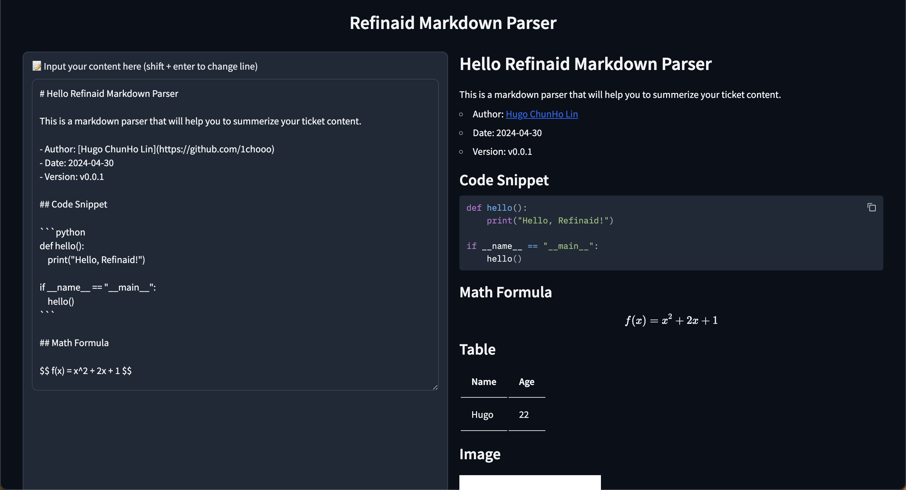

# Markdown Parser



## How to Use

### 1. Create `gr.Blocks` Object

With `gr.Blocks` object, you can create a block that contains multiple components.

```python
with gr.Blocks(
    title='Refinaid Markdown Parser',
) as demo:
    
    gr.HTML(
        "<h1 align=center>Refinaid Markdown Parser</h1>"
    )

    ...
    
demo.launch()
```

### 2. Add `gr.Textbox` Component

With `gr.Textbox` object, you can create a textbox that allows users to input text.

```python
input_markdown_content = gr.Textbox(
    interactive=True,
    label="📝 Input your content here (shift + enter to change line)",
    render=True,
    value=...
)
```

### 3. Add `gr.Markdown` Component

With `gr.Markdown` object, you can create a markdown preview that displays the parsed markdown content.

```python
prev_markdown_content = gr.Markdown(
    value=...
)
```

### 4. Define Listener Function

Define a listener function that will be triggered when the input content changes.

```python
def render_preview(input_markdown_content: str) -> str:
    return input_markdown_content
```


## CONTACT INFO.

> eCloudValley Cloud Developer Intern </br>
> **Hugo ChunHo Lin**
> 
> <aside>
>   📩 E-mail: <a href="mailto:hugo970217@gmail.com">hugo970217@gmail.com</a>
> <br>
>   🧳 Linkedin: <a href="https://www.linkedin.com/in/1chooo/">Hugo ChunHo Lin</a>
> <br>
>   👨🏻‍💻 GitHub: <a href="https://github.com/1chooo">1chooo</a>
>    
> </aside>


## License
Released under [MIT](./LICENSE) by [Refinaid](https://github.com/refinaid).

This software can be modified and reused without restriction.
The original license must be included with any copies of this software.
If a significant portion of the source code is used, please provide a link back to this repository.
